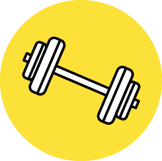
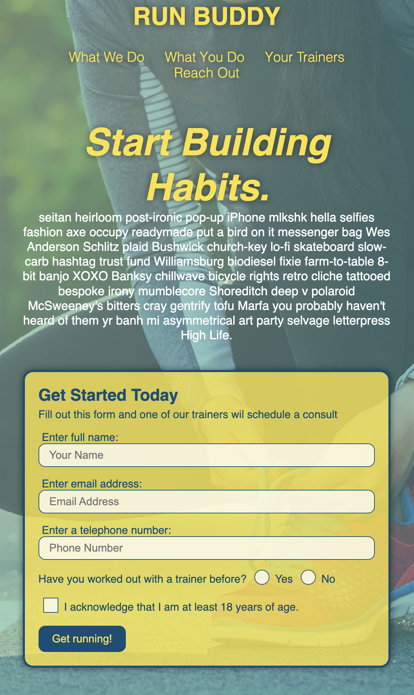
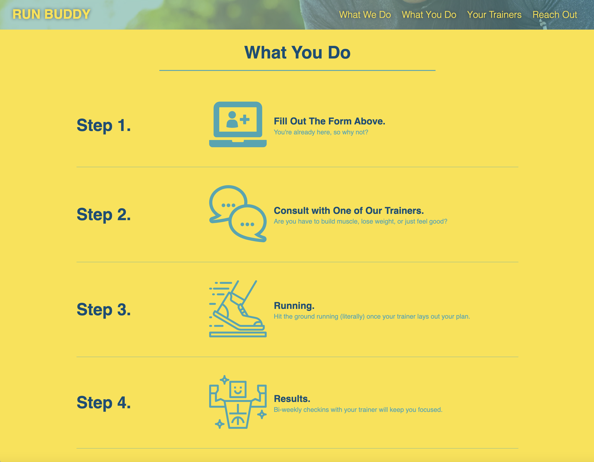

  

<h1 align="center">Run Buddy</h1>

## Purpose
This application is a fitness training service template to demonstrate skills in CSS and Flexbox.

## Decription
Run Buddy is a product of learning how to use flexbox and CSS to create a satisfactory user interface that is mobile responsive. With this project I learned how to create a sticky header, a form with both radio buttons and a checkbox and use iframe tags to embed a google map in the footer section.

## Built With
* HTML
* CSS

## Website
<a href="https://nicolebarranca.github.io/run-buddy/">Run Buddy</a>

 </a>
   </a>
     </a>

## Contribution
Made with ❤️ by Nicole Barranca

## Questions

Feel free to open an issue or contact me directly at nikkibarranca@gmail.com if you have any questions about the repo. You can find more of my work at [Nicole Barranca](https://github.com/NicoleBarranca).

